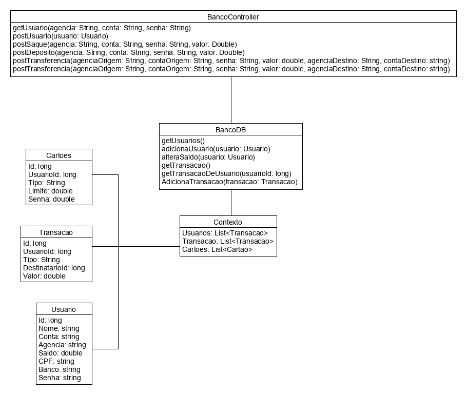

# Tarefa 018 - Diagrama de Classes - 22/09/2021

1. Elabore um diagrama (_UML_) para classes do projeto da _API_ do seu grupo. Estas classes deverão ter todos os detalhes necessários para sua implementação, seja através da notação _UML_ ou da documentação correspondente.
2. Concluída a elaboração do diagrama, exportá-lo para o formato de uma imagem, de preferência no formato _png_.
3. Alterar o código _html_ abaixo, colocando o nome da sua imagem, no lugar de "diagrama.png"

  

**INSTRUÇÕES**
1. Colocar este arquivo "tarefa018.md", quanto o arquivo da imagem, dentro de uma pasta chamada **tarefa018** e fazer o _commit_ para a _branch develop_ do repositório do projeto da _API_do seu grupo.
2. O prazo para entrega desta tarefa é as 23h59min do dia 22/09/2021.
